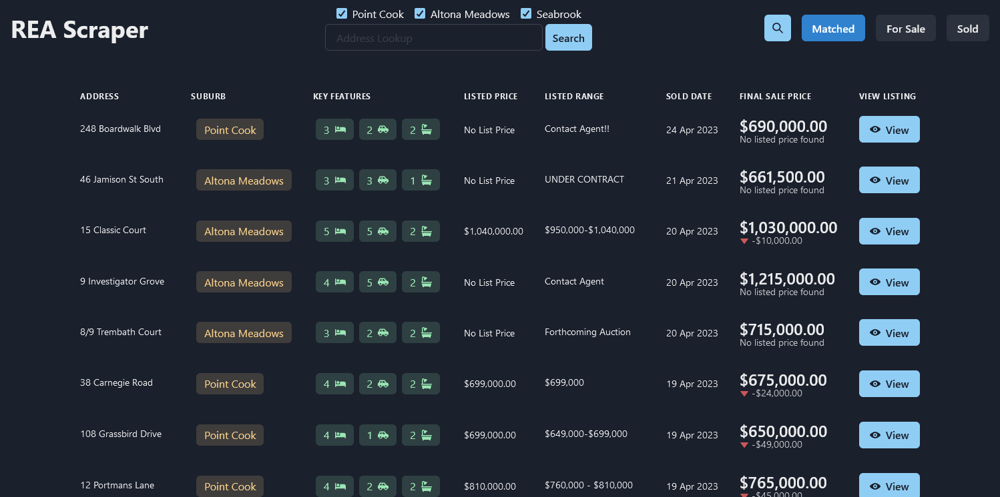

# REA Scraper Viewer | Code Bash



## Aim
While looking to purchase a house we wanted to know what the market in the area was actaully doing rather then reading general stats on the rise and fall of the housing market.
This project will scrap the REA website for listings that have sold and listing that are for sale and save them to a database. An application would then scan the two collections looking for matching to see what a house was listed for and what it sold for. The data was then displayed to the user.
This provided valuble information when working out how much to offer when purchasing a house.

#### Developers Note
Sadly REA increased the security and the scaping tool that was being used ceased to function so the project was stopped.

## Development

From your terminal:

```sh
npm run dev
```

This starts your app in development mode, rebuilding assets on file changes.

## Deployment

First, build your app for production:

```sh
npm run build
```

Then run the app in production mode:

```sh
npm start
```

Now you'll need to pick a host to deploy it to.

### DIY

If you're familiar with deploying node applications, the built-in Remix app server is production-ready.

Make sure to deploy the output of `remix build`

- `build/`
- `public/build/`

### Using a Template

When you ran `npx create-remix@latest` there were a few choices for hosting. You can run that again to create a new project, then copy over your `app/` folder to the new project that's pre-configured for your target server.

```sh
cd ..
# create a new project, and pick a pre-configured host
npx create-remix@latest
cd my-new-remix-app
# remove the new project's app (not the old one!)
rm -rf app
# copy your app over
cp -R ../my-old-remix-app/app app
```
